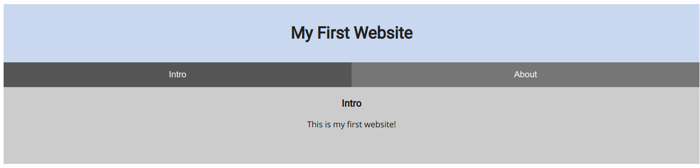
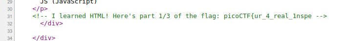
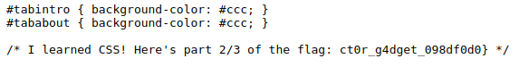

# Inspect Me
**Category:** web exploitation
> Inpect this code! http://2018shell.picoctf.com:35349

---

Pada website yang diberikan, sekilas tidak ada yang aneh pada tampilan website. Namun jika kita buka kodenya menggunakan Ctrl+U (pada _Chrome_) maka kita akan mendapatkan potongan flag pada bagian bawah.

Langkah selanjutnya adalah mendapatkan potongan lain flag. Jika kita teliti kembali, ada 2 file yang di-_import_ yaitu `mycss.css` dan `myjs.js`. Kita coba buka `mycss.css` dan ternyata disitu terdapat potongan flag yang lain.

flag : `picoCTF{ur_4_real_1nspect0r_g4dget_098df0d0}`