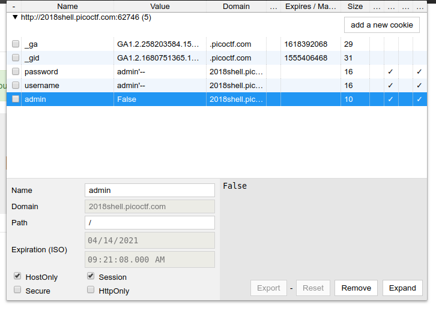

# Logon
**Category:** web exploitation
> I made a website so now you can log on to! I don't seem to have the admin password. See if you can't get to the flag. http://2018shell.picoctf.com:62746

---

Pada halaman login terdapat 2 input username dan password yang digunakan untuk login. Input ini bisa dimasukkan SQL Injection ([Lihat Cheatsheet](https://www.netsparker.com/blog/web-security/sql-injection-cheat-sheet/)).

| Name | Value |
| --- | --- |
| username | admin'-- |
| password | admin'-- |

Kemudian dengan menggunakan cookie editor (saya menggunakan ekstensi [Cookie Editor](https://chrome.google.com/webstore/detail/cookie-editor/hdhngoamekjhmnpenphenpaiindoinpo) Chrome) kita ganti value cookie `admin` dari **False** menjadi **True**, kemudian reload halaman.

flag : `picoCTF{l0g1ns_ar3nt_r34l_92020990}`