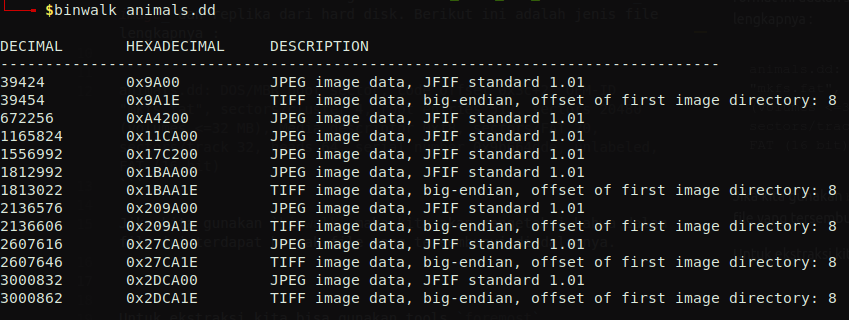

# Recovering From the Snap
**Category:** forensic
> There used to be a bunch of animals here, what did Dr. Xernon do to them?

file : [Download](https://2018shell.picoctf.com/static/b8561b04f5c7107ecb2f15c9a8c79fb8/animals.dd)

---

Pada challenge ini kita diminta untuk mencari flag pada file berekstensi `.dd`. File dengan format ini adalah sebuah file _disk image_ dan replika dari hard disk. Berikut ini adalah jenis file lengkapnya :

```
animals.dd: DOS/MBR boot sector, code offset 0x3c+2, OEM-ID "mkfs.fat", sectors/cluster 4, root entries 512, sectors 20480 (volumes <=32 MB), Media descriptor 0xf8, sectors/FAT 20, sectors/track 32, heads 64, serial number 0x9b664dde, unlabeled, FAT (16 bit)
```

Jika kita gunakan `binwalk` maka kita akan mengetahui bahwa dalam file ini terdapat banyak file yang tersembunyi di dalamnya.



Untuk melakukan ekstraksi kita bisa gunakan tools `foremost`.

```bash
foremost -v animals.dd
```

Berikut adalah hasil audit ekstraksi
```console
┌─[haz@haz]─[~/Programming/CTF/picoctf2018/recover_from_the_snap]
└──╼ $foremost -v animals.dd 
Foremost version 1.5.7 by Jesse Kornblum, Kris Kendall, and Nick Mikus
Audit File

Foremost started at Mon Apr 15 20:47:24 2019
Invocation: foremost -v animals.dd 
Output directory: /home/haz/Programming/CTF/picoctf2018/recover_from_the_snap/output
Configuration file: /etc/foremost.conf
Processing: animals.dd
|------------------------------------------------------------------
File: animals.dd
Start: Mon Apr 15 20:47:24 2019
Length: 10 MB (10485760 bytes)
 
Num	 Name (bs=512)	       Size	 File Offset	 Comment 

0:	00000077.jpg 	     617 KB 	      39424 	 
1:	00001313.jpg 	     481 KB 	     672256 	 
2:	00002277.jpg 	     380 KB 	    1165824 	 
3:	00003041.jpg 	     248 KB 	    1556992 	 
4:	00003541.jpg 	     314 KB 	    1812992 	 
5:	00004173.jpg 	     458 KB 	    2136576 	 
6:	00005093.jpg 	     383 KB 	    2607616 	 
7:	00005861.jpg 	      39 KB 	    3000832 	 
*|
Finish: Mon Apr 15 20:47:24 2019

8 FILES EXTRACTED
	
jpg:= 8
------------------------------------------------------------------

Foremost finished at Mon Apr 15 20:47:25 2019
```

Ekstraksi file `animals.dd` menghasilkan 8 buah file gambar berekstensi `.jpg`. Salah satu gambar terdapat flag yang dicari.


flag : `picoCTF{th3_5n4p_happ3n3d}`
